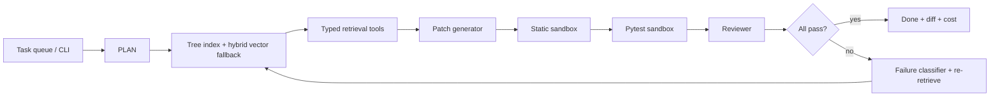

# GrabOn AI Labs - The Coder

GrabOn Coder is a coding agent for a pinned `httpx==0.28.1` checkout. I chose
Assignment 05 because it exercises the full agent-engineering loop: retrieval,
generation, verification, repair, queueing, eval design, and cost discipline.
The agent takes a natural-language change request, retrieves code and
convention context, generates a patch, verifies the patch in temp sandboxes,
and either returns a passing result or explains why the task is impossible.

## What Is Built

- Cached structural index over the target repo: modules, classes, functions,
  methods, reference graph, test map, doc chunks, and code chunks.
- Seven typed retrieval tools with a runtime registry and one deliberately
  unreliable tool for recovery testing.
- Tree-first navigator with a persisted SQLite vector database for code-semantic
  chunks and chunked markdown retrieval for `README.md` and `docs/**/*.md`.
- Agent loop with planning, retrieval, generation, verification, retry, budget
  stop, and Plan-phase impossible-task detection.
- Three verification layers: `ruff` + `mypy`, `pytest` in a temp sandbox, and
  LLM review.
- Background task queue with on-disk snapshot persistence plus a live Rich
  dashboard.
- Benchmark runner, retrieval recall suite, and paired benchmark comparison
  reports.
- Provider adapters for Anthropic, Gemini, Groq, and NVIDIA's hosted
  OpenAI-compatible endpoint.

## Retrieval Design

The core idea is still "map first, search second."

For code edits, the primary job is to find the unit that owns the behavior,
follow imports/references/tests around it, and only fall back to vector-style
search when structural ranking is weak or the task is broad.

That means:

1. structural tree traversal is primary
2. persisted SQLite vector search over local code-semantic embeddings is fallback
3. chunked markdown retrieval covers repo conventions

This is no longer a pure tree-only story, but it is also not conventional
RAG-first retrieval. The implementation is a hybrid that keeps code structure in
the lead.

## Architecture Diagram



## Module Decisions

| Area | Decision | Tradeoff |
|---|---|---|
| Indexing | structural AST/tree index plus persisted chunk store | more explainable than repo-wide blobs; cache schema must stay fresh |
| Retrieval | typed tool traversal before vector fallback | tighter code grounding; more bespoke navigator logic |
| Generation | live model path plus explicit fixture templates | reproducible local regression path; fixture results must never be sold as live |
| Verification | static + pytest + reviewer gates | slower runs; much stronger false-positive control |
| Queue | local threadpool with disk snapshots | demo-friendly and restart-tolerant; not a distributed worker system |

## Latest Verified Results

Benchmark and retrieval numbers below were rerun locally on May 13, 2026.
Live provider smoke and live-coding evidence were refreshed on May 13, 2026.

### How To Read The Eval

There are two deliberately separate proof paths:

1. `fixture` mode is the reproducible regression benchmark. It uses
   deterministic task templates so a fresh clone can verify retrieval,
   patch application, sandboxed static analysis, pytest, reviewer gates,
   retry behavior, impossible-task detection, cost accounting, and report
   generation without API keys.
2. `--live` mode disables those templates and requires real provider calls for
   generation/review. This is the agent proof path for provider behavior,
   live retry behavior, and interview stress tests.

The `12/12` benchmark below is therefore not presented as 12 live LLM coding
runs. The live evidence is stored separately in `reports/` and can be refreshed
with `make live-smoke` and `make live-stress` when provider API keys are
available.

### Benchmark

| Combo | Run Mode | Pass Rate | Impossible Detected | Avg Iterations | Avg Time | Cost |
|---|---|---:|---:|---:|---:|---:|
| A | fixture | 12/12 | yes | 1.0000 | 2.566s | $0.00 |
| B | fixture | 12/12 | yes | 1.0000 | 2.567s | $0.00 |

### Paired Comparison

`reports/comparison_a_vs_b_fixture.json` compares the two fixture benchmark
reports with paired sign-test p-values. In the latest rerun:

- pass rate delta: `0.0`
- iteration delta: `0.0`
- time delta: `0.000999s` in favor of combo `A`
- paired time p-value: `0.387695`

### Retrieval Recall

| Method | Query Count | Avg Precision | Avg Recall | Wins |
|---|---:|---:|---:|---:|
| Tree navigator | 18 | 0.5741 | 0.8444 | 18/18 |
| Grep-style baseline | 18 | 0.1528 | 0.3185 | 0/18 |

### Total Explicit Eval Coverage

- 12 benchmark tasks
- 18 labeled retrieval recall queries
- 30 total explicit eval cases

Raw artifacts live in `reports/`.

## Assignment Requirement Checklist

This table is the source of truth for what the submitted repo claims. It
separates reproducible offline evidence from live-provider evidence so the
benchmark story is auditable instead of implied.

| Assignment Requirement | Status | Evidence | Notes |
|---|---|---|---|
| Real open-source codebase with 50+ files and tests | Pass | `target/httpx` setup plus index/test commands below | Uses pinned `httpx==0.28.1`, not a toy repo. |
| Parse into chunks, embed, store in vector DB | Pass with design note | `src/indexer/tree_index.py`, `src/indexer/vector_store.py`, `src/indexer/semantic_embeddings.py` | Uses code chunks, deterministic local embeddings, and SQLite vector storage as fallback; not a hosted dense-vector service. |
| Retrieve source, imports, tests, README conventions | Pass | `src/retrieval/tools.py`, `src/retrieval/navigator.py` | Typed tools cover source, imports, references, tests, examples, and docs. |
| Better than whole repo / simple search, recall on 10 queries | Pass | `reports/retrieval_recall.json` | 18 labeled queries; tree recall `0.8444` vs grep recall `0.3185`. |
| Generate-test-fix loop, max 5 iterations, report failure | Pass | `src/agent/loop.py`, benchmark reports | Loop retrieves, generates, verifies, retries, and reports exhausted failures. |
| Multi-model routing by stage | Pass | `src/agent/router.py`, provider smoke reports | Cheap/capable stage routing exists; live stage smoke covers Groq and NVIDIA. |
| Cost per task per stage | Pass | `reports/submission_cost_summary.json`, per-task `cost_breakdown` | Fixture cost is correctly `$0.00`; live Groq task has non-zero tracked cost. |
| Three verification layers before done | Pass | live task reports and verification modules | Passing live artifacts show static, pytest, and reviewer all true. |
| Task queue interface | Pass for local demo | `src/queue/task_queue.py`, `src/queue/dashboard.py` | Local threadpool queue with status, result, cost/time, and snapshot persistence; not a distributed production queue. |
| 10+ coding tasks with pass rate, iterations, cost, time | Pass | `reports/combo_a_full.json`, `reports/combo_b_full.json` | 12-task fixture benchmark with full report fields. |
| Compare at least 2 model combinations | Pass with evidence split | `reports/comparison_a_vs_b_fixture.json`, `reports/comparison_nvidia_vs_groq_live_task03.json` | Full comparison is fixture-mode; live comparison exists for task 03. |
| Deep-dive 3+ file live stress task | Pass | `reports/combo_nvidia_mistral_live_task08_multifile.json` | NVIDIA live task-08 now passes in 2 iterations with static, pytest, and reviewer checks true; older failed attempts remain preserved as regression history. |
| Impossible task detection | Pass | `reports/combo_a_full.json`, `reports/combo_b_full.json` | Task 10 is detected as impossible in fixture benchmark. |
| Opus not used for error parsing | Pass | `src/agent/router.py` | Error parsing routes to cheap models/deterministic parsing, not Opus. |

See `reports/README.md` for the full artifact-by-artifact label table.

## Quickstart

```bash
uv sync
git clone --depth 1 --branch 0.28.1 https://github.com/encode/httpx target/httpx
uv run python -m src index --path target/httpx
```

For a fresh Ubuntu/macOS evaluator run, use the offline path first:

```bash
make setup
make test
make eval-a
make eval-b
```

Provider-backed checks are API-key required:

```bash
make live-smoke
make live-stress
```

## Environment

| Variable | Required | Purpose |
|---|---:|---|
| `ANTHROPIC_API_KEY` | optional | Claude live routing |
| `GOOGLE_API_KEY` | optional | Gemini live routing |
| `GROQ_API_KEY` | optional | Groq live routing |
| `NVIDIA_API_KEY` | optional | NVIDIA hosted OpenAI-compatible routing |
| `GEMINI_MODEL` | optional | defaults to `gemini-2.5-flash-lite` |
| `NVIDIA_MODEL` | optional | defaults to `mistralai/mistral-small-4-119b-2603` |
| `NVIDIA_INPUT_COST_PER_1K` | optional | defaults to `0.0` for free-tier NIM accounting |
| `NVIDIA_OUTPUT_COST_PER_1K` | optional | defaults to `0.0` for free-tier NIM accounting |
| `TARGET_CODEBASE_PATH` | optional | defaults to `./target/httpx` |
| `COST_BUDGET_PER_TASK_USD` | optional | task halt budget |
| `MAX_ITERATIONS` | optional | defaults to `5` |
| `INDEX_CACHE_ENABLED` | optional | enable/disable persisted index cache |

## CLI

```bash
uv run python -m src index --path target/httpx
uv run python -m src submit "Add a timeout_seconds property to Request class" --path target/httpx
uv run python -m src eval --combo a --path target/httpx --output reports/combo_a_full.json
uv run python -m src eval --combo b --path target/httpx --output reports/combo_b_full.json
uv run python -m src eval --combo a --live --tasks task_03_url_copy_with_tests --path target/httpx --output reports/combo_a_live_task03.json
NVIDIA_MODEL='mistralai/mistral-small-4-119b-2603' uv run python -m src eval --combo nvidia --live --tasks task_03_url_copy_with_tests --path target/httpx --output reports/combo_nvidia_mistral_live_task03.json
uv run python -m src eval --combo groq --live --tasks task_03_url_copy_with_tests --path target/httpx --output reports/combo_groq_live_task03.json
uv run python -m src eval --combo a --live --limit 1 --path target/httpx --output reports/combo_a_live_smoke.json
uv run python -m src retrieval-eval --path target/httpx --output reports/retrieval_recall.json
uv run python -m src compare-eval --left reports/combo_a_full.json --right reports/combo_b_full.json --output reports/comparison_a_vs_b_fixture.json
uv run python -m src compare-eval --left reports/combo_a_live_task03.json --right reports/combo_nvidia_live_task03.json --output reports/comparison_a_vs_nvidia_live_task03.json
uv run python -m src provider-smoke --combos a,nvidia --output reports/provider_smoke_live.json
uv run python -m src provider-smoke --combos a,nvidia --stages planning,context_ranking,error_parsing,test_analysis,llm_review --output reports/provider_stage_smoke_live.json
NVIDIA_MODEL='mistralai/mistral-small-4-119b-2603' uv run python -m src provider-smoke --combos nvidia --stages planning,context_ranking,error_parsing,test_analysis,llm_review --output reports/provider_stage_smoke_nvidia_mistral.json
uv run python -m src provider-smoke --combos groq --stages planning,context_ranking,error_parsing,test_analysis,llm_review --output reports/provider_stage_smoke_groq.json
uv run python -m src cost-report --reports-dir reports --output reports/submission_cost_summary.json
uv run python -m src dashboard "Add a timeout_seconds property to Request class"
```

## Repo Guide

- `ARCHITECTURE.md`: agent loop, routing, verification, queue, and system shape.
- `SYSTEM_DESIGN.md`: visual Mermaid architecture for quick evaluator review.
- `LOOM_DEMO_GUIDE.md`: recording script, live-demo commands, and the
  tree-first-vs-traditional-RAG rationale.
- `RETRIEVAL.md`: index schema, navigation behavior, fallback search, and recall
  protocol.
- `EVAL.md`: benchmark tasks, retrieval eval corpus, and report formats.
- `reports/`: latest benchmark, retrieval, comparison, and live smoke outputs.
- `src/`: implementation.
- `tests/`: repo test suite.

## Verified Locally

```bash
uv run python -m pytest -q
uv run ruff check src tests
uv run mypy src --ignore-missing-imports
uv run python -m src index --path target/httpx
uv run python -m src retrieval-eval --path target/httpx --output reports/retrieval_recall.json
uv run python -m src eval --combo a --path target/httpx --output reports/combo_a_full.json
uv run python -m src eval --combo b --path target/httpx --output reports/combo_b_full.json
uv run python -m src eval --combo a --live --limit 1 --path target/httpx --output reports/combo_a_live_smoke.json
NVIDIA_MODEL='mistralai/mistral-small-4-119b-2603' uv run python -m src eval --combo nvidia --live --tasks task_03_url_copy_with_tests --path target/httpx --output reports/combo_nvidia_mistral_live_task03.json
uv run python -m src eval --combo groq --live --tasks task_03_url_copy_with_tests --path target/httpx --output reports/combo_groq_live_task03.json
uv run python -m src compare-eval --left reports/combo_a_full.json --right reports/combo_b_full.json --output reports/comparison_a_vs_b_fixture.json
uv run python -m src provider-smoke --combos a,nvidia --output reports/provider_smoke_live.json
uv run python -m src provider-smoke --combos a,nvidia --stages planning,context_ranking,error_parsing,test_analysis,llm_review --output reports/provider_stage_smoke_live.json
NVIDIA_MODEL='mistralai/mistral-small-4-119b-2603' uv run python -m src provider-smoke --combos nvidia --stages planning,context_ranking,error_parsing,test_analysis,llm_review --output reports/provider_stage_smoke_nvidia_mistral.json
uv run python -m src provider-smoke --combos groq --stages planning,context_ranking,error_parsing,test_analysis,llm_review --output reports/provider_stage_smoke_groq.json
uv run python -m src cost-report --reports-dir reports --output reports/submission_cost_summary.json
```

## Honest Limits

- The reproducible benchmark path is still `fixture` by default. It is an
  offline regression harness, not a claim that every benchmark task was solved
  by a live model call. The generator uses deterministic task templates unless
  `--live` is enabled.
- Live provider routing has smoke evidence for Gemini + NVIDIA in
  `reports/provider_smoke_live.json`, and NVIDIA stage-smoke evidence
  across planning, context ranking, error parsing, test analysis, and review in
  `reports/provider_stage_smoke_nvidia_mistral.json`.
- `reports/combo_a_live_smoke.json` is a real Gemini live coding run that passed
  retrieval, patch generation, static checks, pytest, and reviewer checks.
- `reports/combo_nvidia_mistral_live_task03.json` is a real NVIDIA NIM live
  coding run that passed retrieval, patch generation, static checks, pytest, and
  NVIDIA reviewer checks.
- `reports/combo_groq_live_task03.json` is a real Groq live coding run that
  passed retrieval, patch generation, static checks, pytest, and Groq reviewer
  checks with non-zero tracked cost.
- `reports/combo_nvidia_mistral_live_task08_multifile.json` is a real NVIDIA
  NIM live coding run for the multi-file task-08 stress case. It passed in 2
  iterations with static analysis, pytest, and reviewer checks all true.
- Older multi-file live attempts are still preserved as failed regression
  history: `reports/combo_nvidia_llama70b_live_task07_multifile.json`,
  `reports/combo_nvidia_llama70b_live_task08_multifile.json`,
  `reports/combo_groq_live_task08_multifile.json`, and
  `reports/combo_a_live_task08_multifile.json`. Failed live-attempt JSON
  reports carry a top-level `submission_status` field so they cannot be
  mistaken for passing artifacts.
- Live retry paths now call the `refactoring` model stage after a failed
  generation attempt, and deterministic review rejects behavioral source diffs
  that do not add or update focused tests.
- Cost tracking is implemented per stage and per task. Fixture benchmark costs
  are still `$0.00`, while live reports and `submission_cost_summary.json`
  separate measured live spend from fixture runs.
- The vector layer is a local SQLite vector database over deterministic
  code-semantic embeddings. It is intentionally local/reproducible rather than
  a hosted vector database service.
- Groq is the recommended replacement second live coding provider if a
  `GROQ_API_KEY` is available. The Groq route already separates cheap-stage and
  capable generation models; NVIDIA remains supported because it is currently
  configured in this workspace.

## Cost Data

The repo tracks per-stage and per-task cost in `TaskResult` plus benchmark JSON.
Fixture reports correctly show `$0.00` because they do not spend provider tokens.
Live reports should be used for submission cost claims, not fixture reports.

Current committed cost/evidence files:

- `reports/combo_a_full.json`
- `reports/combo_b_full.json`
- `reports/combo_a_live_smoke.json`
- `reports/combo_a_live_task03.json`
- `reports/combo_nvidia_live_task03.json`
- `reports/combo_nvidia_mistral_live_task03.json`
- `reports/combo_nvidia_mistral_live_task08_multifile.json`
- `reports/combo_groq_live_task03.json`
- `reports/combo_groq_live_task08_multifile.json`
- `reports/provider_stage_smoke_nvidia_mistral.json`
- `reports/provider_stage_smoke_groq.json`
- `reports/comparison_a_vs_b_fixture.json`
- `reports/comparison_a_vs_nvidia_live_task03.json`
- `reports/comparison_a_vs_nvidia_mistral_live_task03.json`
- `reports/comparison_nvidia_vs_groq_live_task03.json`
- `reports/provider_smoke_live.json`
- `reports/provider_stage_smoke_live.json`
- `reports/submission_cost_summary.json`

## What Broke First

The hardest bug was cache drift after the hybrid retrieval layer was added.
Legacy JSON caches still loaded successfully, but they lacked `code_chunks` and
`vector_store_path`, so normal cached runs silently lost the new vector fallback.
The fix rejects stale hybrid-incomplete caches and rebuilds them before use; the
regression test now covers that upgrade path.

## What I Would Change With 2 More Weeks

1. Try stronger dense embeddings while keeping tree-first traversal.
2. Add a durable worker queue and richer run history storage.
3. Generalize the multi-file patch stabilizer beyond the CacheTransport stress case.
4. Add a secrets-enabled CI workflow for optional live provider smoke runs.
5. Generalize navigator priors beyond the pinned `httpx` assignment target.
