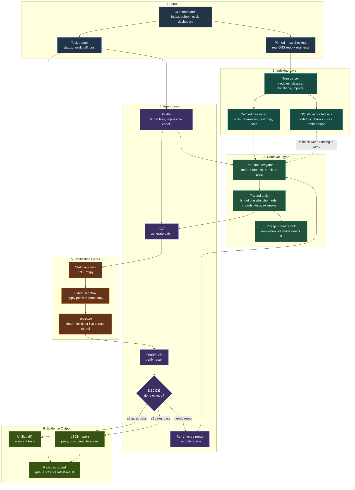

# SYSTEM_DESIGN.md - GrabOn Coder Visual Architecture

This is the visual version of `ARCHITECTURE.md`. Use it in the Loom before
opening code so the reviewer understands the system shape in one screen.

## System Diagram

## One-Screen Explanation

The system is not just a chatbot over code. It is a coding-agent loop:

1. It indexes a real `httpx` checkout into structural code units.
2. It retrieves by module, symbol, imports, references, tests, and docs.
3. It uses vector search only as a fallback when structural ranking is weak.
4. It generates a patch.
5. It verifies the patch with static checks, pytest, and review.
6. It retries with better context or returns a clear failure.
7. It writes JSON reports with pass status, time, cost, iterations, and models.

## Why The Diagram Is Shaped This Way

For code edits, the unit of truth is usually not an arbitrary text chunk. It is
a function, class, import edge, test file, or convention. That is why the
control flow starts with a tree index and typed tools. The vector store exists,
but it is not the main driver. It is the fallback when the task is broad,
semantic, or under-specified.

## What To Point At In Loom

- Point at `Target -> Parser -> Tree`: "This is why it knows the codebase
  structure instead of blindly stuffing files into context."
- Point at `Vector`: "I still satisfy the chunk/embed/store requirement, but I
  use it as fallback, not the first source of truth."
- Point at `Navigator -> Tools`: "The retriever has inspectable actions:
  list module, get class, get function, find references, imports, tests."
- Point at `Static -> Pytest -> Review`: "Done means verified, not just
  generated."
- Point at `Report`: "Every run produces auditable evidence: pass/fail,
  iterations, time, provider models, and cost."

