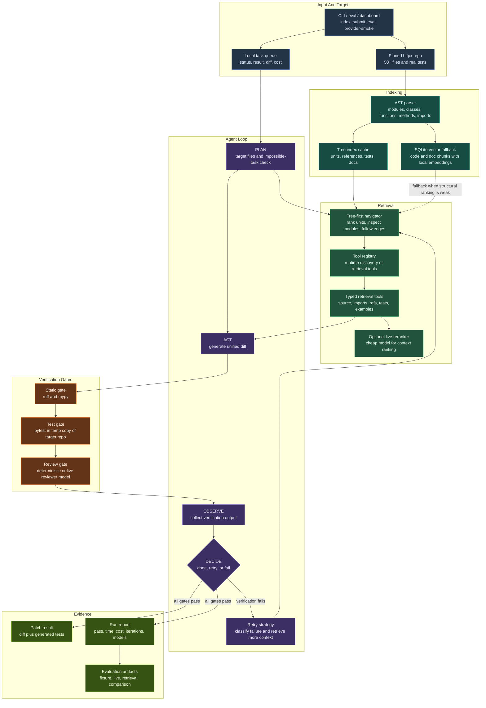

# SYSTEM_DESIGN.md - GrabOn Coder

This document explains the submitted system from an evaluator's perspective:
what the agent is, where the main boundaries are, how code context is retrieved,
how patches are verified, and which artifacts prove the claims.

## System Boundary

GrabOn Coder is a repository-aware coding agent built around a pinned
`httpx==0.28.1` checkout. It is not a general chat interface over source files.
The system accepts a natural-language coding task, retrieves relevant code and
test context, generates a patch, verifies the patch, and records auditable run
evidence.

In scope:

- structural indexing over the target repository
- typed retrieval tools for code, imports, references, tests, and docs
- live or fixture-backed patch generation
- static analysis, sandboxed pytest, and reviewer verification
- retry loop with max-iteration and cost accounting
- JSON benchmark, live-run, retrieval, and cost reports
- local task queue and terminal dashboard

Out of scope:

- distributed production job processing
- hosted vector database infrastructure
- full live execution of every fixture benchmark task
- claiming failed live attempts as benchmark passes

## Architecture Diagram

## Component Responsibilities

| Layer | Responsibility | Primary Files |
|---|---|---|
| Indexing | Parse the target repo into structural units, references, tests, docs, and fallback chunks. | `src/indexer/ast_parser.py`, `src/indexer/tree_index.py`, `src/indexer/vector_store.py` |
| Retrieval | Build task-specific context by traversing modules, symbols, imports, references, and tests before using vector fallback. | `src/retrieval/navigator.py`, `src/retrieval/tools.py`, `src/retrieval/registry.py` |
| Agent loop | Plan, generate, verify, decide, and retry up to the configured iteration limit. | `src/agent/loop.py`, `src/agent/generator.py`, `src/agent/router.py` |
| Verification | Run static analysis, sandboxed pytest, and review before marking a task done. | `src/verification/static.py`, `src/verification/test_runner.py`, `src/verification/reviewer.py` |
| Queue/UI | Provide a local submit/status/result surface for demos and inspection. | `src/queue/task_queue.py`, `src/queue/dashboard.py` |
| Evaluation | Run fixture benchmarks, live provider checks, retrieval recall, comparisons, and cost summaries. | `src/eval/benchmark.py`, `src/eval/retrieval_recall.py`, `src/eval/compare.py`, `src/eval/cost_report.py` |

## Retrieval Design Rationale

The retrieval design is tree-first rather than traditional RAG-first.

Traditional RAG usually starts by chunking documents, embedding them, retrieving
top-k similar chunks, and prompting a model with those chunks. That is useful
for knowledge-answering systems, but code editing has stricter constraints:

- behavior is owned by functions, classes, methods, and modules
- correct edits often depend on imports, references, tests, and public APIs
- a plausible text chunk can still point to the wrong edit location
- success must be verified by tooling, not judged only by answer fluency

This system still includes a chunk, embedding, and SQLite vector fallback path.
The difference is control flow: structural retrieval is primary, and vector
retrieval is used when structural ranking is weak, broad, or under-specified.

## Verification Model

A generated patch is not considered successful after generation alone. The
agent requires all relevant verification gates to pass:

1. static analysis with `ruff` and `mypy`
2. pytest execution in a temporary copy of the target repository
3. deterministic or live reviewer pass

On failure, the loop classifies the error, expands file/context hints, and
retrieves again before another generation attempt. The maximum iteration count
is five.

## Evidence Map

| Claim | Evidence |
|---|---|
| The target is a real OSS repo with tests. | `target/httpx` setup instructions and `uv run python -m src index --path target/httpx` |
| Retrieval is measured separately from generation. | `reports/retrieval_recall.json` |
| Fixture benchmark is reproducible without API keys. | `reports/combo_a_full.json`, `reports/combo_b_full.json` |
| Live provider calls are supported. | `reports/provider_stage_smoke_groq.json`, `reports/provider_stage_smoke_nvidia_mistral.json` |
| Live coding runs are preserved as evidence. | `reports/combo_groq_live_task03.json`, `reports/combo_nvidia_mistral_live_task03.json` |
| Multi-file live stress evidence exists. | `reports/combo_nvidia_mistral_live_task08_multifile.json` |
| Cost and model routing are tracked. | per-report `cost_breakdown` fields and `reports/submission_cost_summary.json` |
| Failed live attempts are not counted as passes. | `reports/README.md` |

## Evaluator Reading Notes

- The fixture `12/12` benchmark is a deterministic regression harness, not a
  claim that all 12 tasks were solved by live LLM calls.
- Live provider evidence is stored separately in `reports/` and marked by
  report file name and status fields.
- The vector database layer is local SQLite fallback infrastructure, not an
  external managed vector DB.
- The task queue is a local demo and inspection surface, not distributed
  production infrastructure.
- Failed live artifacts are intentionally retained for auditability and are not
  counted as successful benchmark results.

